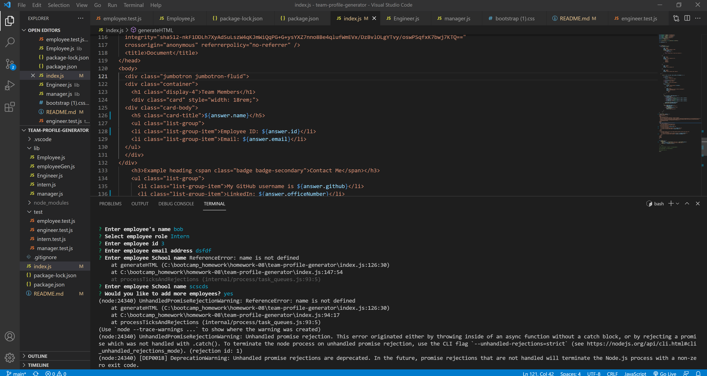
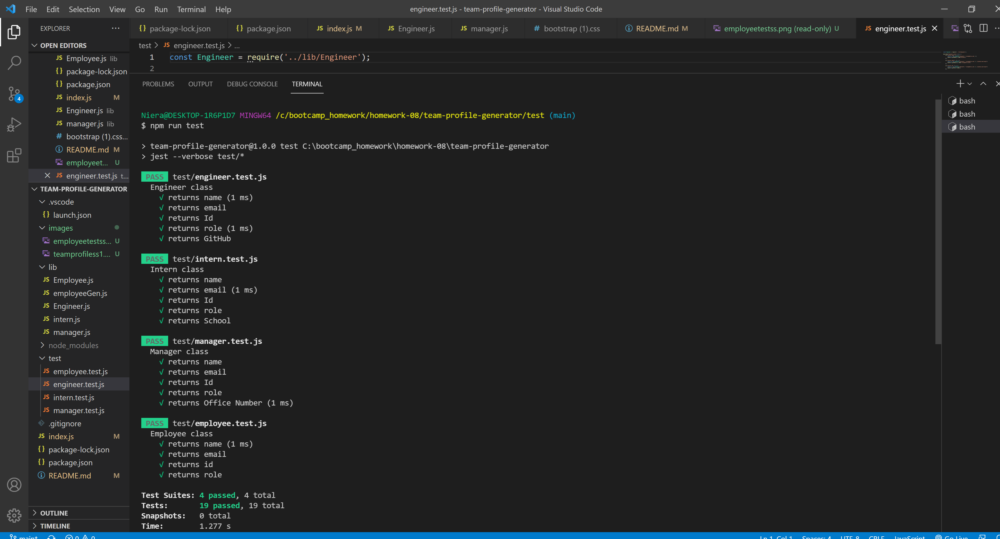

# team-profile-generator
# 10 Object-Oriented Programming: Team Profile Generator

## overview
* As requested I created a team profile generator using node
* It will run prompts to generate cards that have an employee profile
* after running into several problems I have got to a point of basic functionallity 

## Thanks 
* I thank the T.A.s for help in this assignment
* my tutor Greg for direction on how to get started 

### screenshots

* I was able to get the node prompts to work altough I wasnt able to get the html to generate. I saught help but I need more research to fix problem.

* With help from my tutor I was able to run tests and pass them

* with help we couldn't resolve the issue with an undefined error
* altough I please that I was able to run and pass tests

